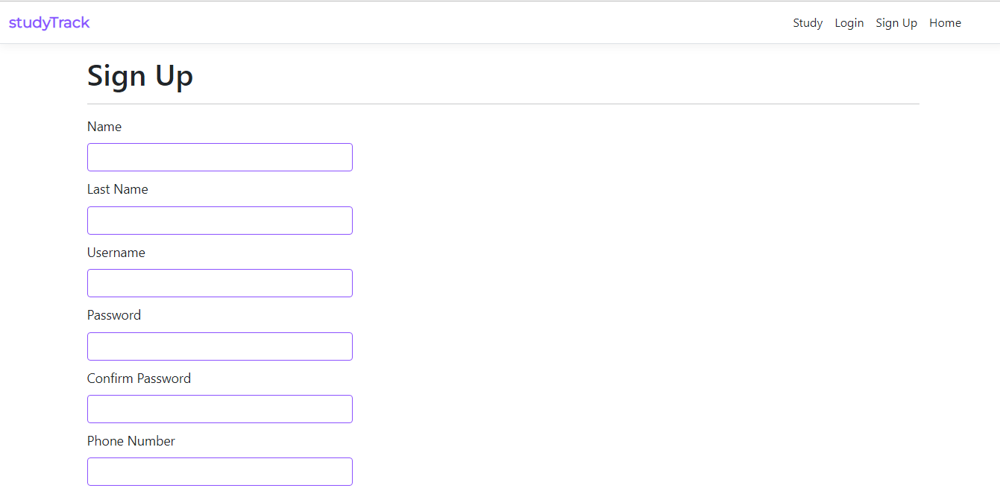
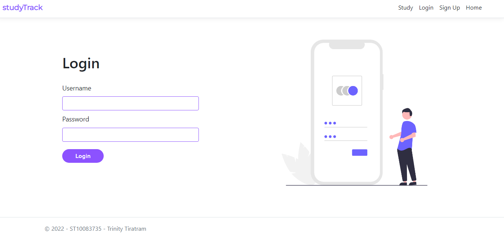

# Study Track App

This is a solution the final part of the PROG6212 POE.

## Test Account
Username: Trin

Password: Password1*

## Table of contents

- [Overview](#overview)
  - [The scenario](#the-scenario)
  - [Changes](#changes)
  - [Built with](#built-with)
  - [Prerequisites](#prerequisites)
  - [Extra Features](#extra-features)
  - [Screenshots](#screenshots)

## Overview

## The scenario

The scenario is to create a web application that will allow the user to access their data from any
device that has a browser.
The application that can be used for personal
study tracking. 
The user will have to input:
- Module Code
- Module Name
- Module Credits
- Class Hours
- Semester Start Date
- Weeks In The Semester

The program will calculate the number of hours a student needs to study **WEEKLY** using the module credits and that number multiplied by ten will be the number of
hours spent on it throughout the semester. For instance, PROG6212 is 15 credits, so 150 hours
must be spent on it. Some of that will be class hours, and the rest will have to be distributed
throughout the weeks.

When the user decides to log how long they have studied for they will be prompted to enter the: 
 - Module Code
 - Time they studied for
 - Date they last studied
 
Whenever the user adds a module it will displayed  to them.
When they update a module it will be displayed along with the:
 - Hours they should study for
 - Time they studied for
 - The time left they need to study for
 - The date they last studied

For the final part of the project, the user must be able to set aside a specific day of the week for each module. When the
website is accessed, a reminder must be shown that tells the user which module is planned
for the day.

I have also implemented a graph that will display over time the number of hours spent on
a module per week. The ideal calculated number of hours will also be displayed on the
graph.

The program also makes use of a custom class library that deals with all module calculations as well as validation.

## Changes
Part 1 Changes:
1. Added a list box on the add modules page to show users what modules they have added as they have added it.
2. Normalised Module class.
3. Added a page to show user all their study sessions for a specific module.

Part 2 Changes (02/11/2022):
1. The software shall persist the data in a SQL database.
2. The user shall be able to register with a username and password.
3. The software shall store only the hash of the password in the database.
4. The user shall be able to log into the software with their username and password.
5. The user shall only be able to see their own data and never that of other users.

Final Changes (02/12/2022):
1. User is notified if they have a study session for the day.
2. User is able to view a graph that displays their ideal study hours vs their actual study hours.
3. Added a bridge table Module Entry. Now when a user adds a module, it will be added to the module entry table if it does not already exist in the module table.

## Built With
  
  - C#
  - .NET 6.0
  - ASP.NET Core Web Application(MVC)
  - Bootstrap v5.2.3
 
  ### Images
  - [Undraw](https://undraw.co/) 
  - [Flaticon](https://www.flaticon.com/free-icon/books-stack-of-three_29302?term=books&page=1&position=7&page=1&position=7&related_id=29302&origin=search)

## Prerequisites

  - .NET 6.0

## Extra Features

User is able to view a graph that displays their ideal study hours vs their actual study hours.

## Screenshots

[Go To TOP](#TOP)
