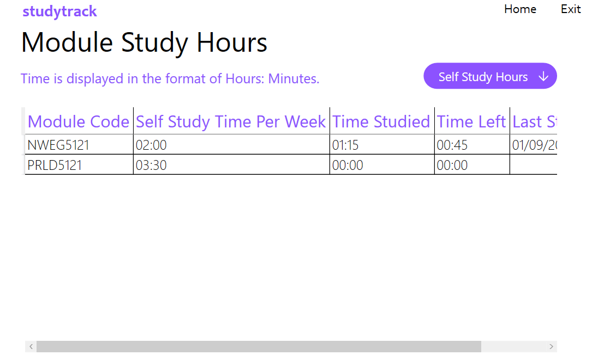

# Study Track App

This is a solution to Part 1 the PROG6212 POE.
### Note: You will first need to build the solution, to allow some components to be displayed correctly.

## Table of contents

- [Overview](#overview)
  - [The scenario](#the-scenario)
  - [Built with](#built-with)
  - [Screenshots](#screenshots)
  - [Extra Features](#extra-features)

## Overview

## The scenario

The scenario is to create an application that can be used for personal
study tracking. 
The user will have to input:
- Module Code
- Module Name
- Module Credits
- Class Hours
- Semester Start Date
- Weeks In The Semester

The program will calculate the number of hours a student needs to study **WEEKLY** using the module credits and that number multiplied by ten will be the number of
hours spent on it throughout the semester. For instance, PROG6212 is 15 credits, so 150 hours
must be spent on it. Some of that will be class hours, and the rest will have to be distributed
throughout the weeks.

When the user decides to log how long they have studied for they will be prompted to enter the: 
 - Module Code
 - Time they studied for
 - Date they last studied
 
Whenever the user adds a module it will displayed on a Datagrid to them.
When they update a module it will be displayed on a Datagrid along with the:
 - Hours they should study for
 - Time they studied for
 - The time left they need to study for
 - The date they last studied

The program also makes use of a custom class library that deals with all module calculations as well as validation.

### Built With
  
  - C#
  - WPF(Windows Presentation Foundation)
  ## Images
  - [Undraw](https://undraw.co/) 
  - [Flaticon](https://www.flaticon.com/free-icon/books-stack-of-three_29302?term=books&page=1&position=7&page=1&position=7&related_id=29302&origin=search)

### Screenshots

On starting the app the user will see landing page.
- - - -

- - - -

If they click get started they will be directed to the add modules page.

- - - -

- - - -

Once the user inputs all data correctly and clicks on the Add Module button, a Complete button will become visible.If the user clicks on the complete button they will be redirected to the home page or they can fill in details to add another module.

- - - -

- - - -

If the user does not input a certain field, an error will be displayed.

- - - -

- - - -

If the user has already added the module, an error will be displayed.

- - - -

- - - -

If the user clicks the complete button before saving the module, an alert will be displayed.

- - - -

- - - -

On the home page, if the user clicks on the View Modules button a page will be displayed that shows them a list of all their modules.

- - - -

- - - -

If they click the Delete Module button on the home page, a page will be displayed that asks the user to select the module they want to delete and confirm the deletion of the module.

- - - -

- - - -

If they click on the Complete Button without confirming the deletion or selecting a module, an error will be displayed.

- - - -

- - - -

On the home page, if the user clicks the Record Hours button they will be redirected to a page to record the time that they have been studying for and if the user clicks the complete button without filling in all the details, they will not be able to move further. **Note: The dates the user can choose from are the start date of the current semester and the current date that they are using the application.**

- - - -

 

 

- - - - 

The user can also view the modules, along with the calculate study hours, amount of time they spent studying and the date they last studied, when they click the View Study Hours button.

- - - -

- - - - 

If the user did not add any modules, then the datagrid where they can view all modules and the datagrid with the study hour details will not be filled.
- - - -

- - - -

### Extra Features
  
  Some extra features in this app include:
  - A delet function that allows user to delete any modules they no longer need to study for.
  - The user is able to order the study hours datagrid, by calculate field **Study Hours Per Week**.

[Go To TOP](#TOP)
